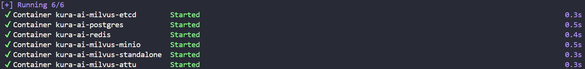
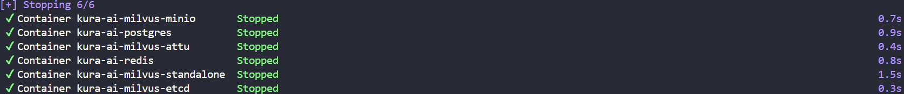
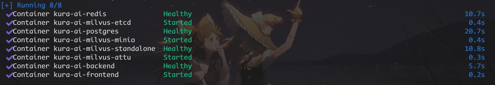

<p align="center">
  <a href="https://github.com/MarisaMagic/Kura-AI">
    
  </a>
</p>

<h1 align="center">Kura AI</h1>

## 项目简介

基于 FastAPI + Vue 3 + LangChain + LangGraph 的知识库对话智能体平台。支持自定义智能体（模型、提示词、知识库、MCP 工具）、多轮对话、长短期记忆、多模态知识库与会话附件理解。智能体基于 Tool-Use-Loop 自主规划，按需调用知识库检索、联网搜索、会话记忆、附件读写及 MCP 外部工具完成任务。

使用项目模板: [vue-fastapi-admin](https://github.com/mizhexiaoxiao/vue-fastapi-admin)

---

## 核心功能

### 智能体中心


### 智能体对话


### 知识库检索


### 历史对话列表


### 联网搜索


### MCP 外部工具


### 附件内容对话


### 智能体共享


### 暗色主题切换


---


## 部署方式 1: 本地启动项目（适用于开发者）

### 后端

启动项目需要以下环境：
- Python 3.11

1. 创建虚拟环境

```sh
python3 -m venv venv
```

或者使用 conda 创建虚拟环境（需要提前配置好 [Anaconda](https://www.anaconda.com/download)）:

```sh
conda create -n Kura-AI python=3.11 -y
```

2. 激活虚拟环境

```sh
source venv/bin/activate  # Linux/Mac
# 或
.\venv\Scripts\activate  # Windows
```

如果使用的是 conda 虚拟环境:

```sh
conda activate Kura-AI
```

3. 安装依赖

```sh
pip install -r requirements.txt -i https://pypi.tuna.tsinghua.edu.cn/simple
```

4. 启动后端服务

建议预先启动 docker [数据库服务](#数据库服务)

```sh
python run.py
```

后端启动成功输出: 

```sh
2026-04-29 16:27:48 - INFO - Will watch for changes in these directories: [项目路径]
2026-04-29 16:27:48 - INFO - Uvicorn running on http://0.0.0.0:9999 (Press CTRL+C to quit)
2026-04-29 16:27:48 - INFO - Started reloader process [32712] using WatchFiles
2026-04-29 16:27:52 - INFO - Started server process [25192]
2026-04-29 16:27:52 - INFO - Waiting for application startup.
2026-04-29 16:27:52 - INFO - Application startup complete.
```

访问 http://localhost:9999/docs 可查看API文档

---

### 前端

启动项目前端环境建议：
- node v18.8.0+

1. 进入前端目录

```sh
cd web
```

2. 安装依赖 

建议使用 pnpm: https://pnpm.io/zh/installation

```sh
npm i -g pnpm # 已安装可忽略
pnpm i # 或者 npm i
```

3. 启动

```sh
pnpm dev
```

前端启动成功输出：

```sh
VITE v5.4.21  ready in 20287 ms

➜  Local:   http://localhost:3100/                                                                                 
➜  Network: http://169.254.128.15:3100/                                                                               
➜  Network: http://169.254.47.198:3100/                                                                               
➜  Network: http://192.168.32.245:3100/                                                                               
➜  Network: http://172.17.128.1:3100/                                                                                 
➜  press h + enter to show help   
```

---

### 数据库服务

使用 docker 部署 PostgreSQL、Redis、Milvus 镜像服务（需要先安装 [Docker](https://www.docker.com/products/docker-desktop/)）。

docker 配置脚本: `docker-compose.yml`

```sh
# 读取当前目录下的 docker-compose.yml 文件，并启动其中定义的所有服务。
# 如果本地没有数据库镜像文件会先拉取镜像
docker compose up -d
```

启动数据库镜像服务成功输出:



停止所有数据库服务:

```sh
docker compose stop
```

停止数据库镜像服务成功输出:



二次开发：用上面的命令只起数据库，再分别 `python run.py` 与 `pnpm dev`。若要把前后端也打进镜像、一条命令访问网页，见下方「快速一键部署」。

---

### 环境变量配置

将仓库根目录的 `.env.example` 复制为 `.env`，再填写密钥（填好的 `.env` 勿提交仓库）：

```sh
# Linux / macOS
cp .env.example .env

# Windows PowerShell
Copy-Item .env.example .env
```

至少填写：

- `SECRET_KEY`（生成：`openssl rand -hex 32`）
- `INITIAL_ADMIN_PASSWORD`（至少 8 位，含字母与数字）
- `EMBEDDING_API_KEY`
- 启用知识库重排时再填 `RERANK_API_KEY`
- 国内联网搜索可填 `WEB_SEARCH_BOCHA_API_KEY`（默认同时启用博查 Semantic Reranker）

完整项与注释见 `.env.example`。公网上线请再对照下方「公网部署清单」。

---

## 部署方式2: 一键快速部署（Docker）

### 运行命令

前置：已安装 [Docker Desktop](https://www.docker.com/products/docker-desktop/)，并已按上一节准备好根目录 `.env`（至少填写 `SECRET_KEY`、`INITIAL_ADMIN_PASSWORD`、`EMBEDDING_API_KEY`）。

在项目根目录运行命令：

```sh
# 首次或代码有变更时加 --build
docker compose -f docker-compose.prod.yml up -d --build
```

启动成功：



启动成功后浏览器打开 **http://localhost:8088** 即可访问（端口可用 `.env` 里的 `WEB_PORT` 更改）。

---

### 常用命令与说明

一键快速部署通过把 Vue 打成静态文件由 Nginx 托管，FastAPI 单独一个容器；Nginx 将 `/api/v1` 反代到后端（和本地 `pnpm dev` 的 Vite 代理同一思路）。数据库仍用现有 `docker-compose.yml`。

首次构建会拉 Python / Node / Milvus 等镜像，并执行 `pnpm build` 与 `pip install`，可能需要十几分钟。之后再启动会快很多。

常用命令：

```sh
# 查看状态
docker compose -f docker-compose.prod.yml ps

# 只停前后端，数据库继续跑（方便切回本地 python / pnpm 开发）
docker compose -f docker-compose.prod.yml stop backend frontend

# 停止全部（含数据库）
docker compose -f docker-compose.prod.yml stop

# 看后端日志
docker compose -f docker-compose.prod.yml logs -f backend
```

说明：

- 已在跑 `docker compose up -d`（仅数据库）时，再执行上面的 prod 命令只会补起 `backend` / `frontend`，数据目录共用 `volumes/`。
- 容器内会覆盖 `.env` 里的本机地址：`DATABASE_URL` / `REDIS_URL` / `MILVUS_HOST` 改为 Docker 服务名，`UVICORN_HOST=0.0.0.0`。本机开发不受影响。
- 后端不对外暴露 9999；浏览器只访问 Nginx 的 `WEB_PORT`。
- 公网请把 `PROD_PUBLIC_API_BASE` 设为站点根地址（如 `https://your.domain`），并继续核对下面的清单。

相关文件：`deploy/Dockerfile.backend`、`deploy/Dockerfile.frontend`、`deploy/nginx.conf`、`docker-compose.prod.yml`。

数据库结构/数据补丁：启动时自动应用版本化补丁（见 [`app/core/schema_patches.py`](app/core/schema_patches.py)，按 `schema_patch_log` 表去重）。

---

## 公网部署清单

上线前请核对（本仓库默认面向本机开发）：

- `DEBUG=false`（否则 Header `token=dev` 可跳过 JWT）
- `ALLOW_PUBLIC_REGISTRATION=false`
- `DOCS_ENABLED=false`
- `ALLOW_PRIVATE_UPSTREAM_URLS=false`
- `UVICORN_HOST=127.0.0.1`，前面用 Nginx/Caddy 做 HTTPS 反代（`docker-compose.prod.yml` 已在容器内用 Nginx 反代，且不把 9999 映射到宿主机）
- `AUTH_TRUST_X_FORWARDED_FOR` 仅在**可信**反代之后开启；nginx 须覆盖（而非追加）`X-Forwarded-For`
- 生产单独配置 `API_KEY_ENCRYPTION_KEY`，不要只靠 `SECRET_KEY` 派生
- Access JWT 默认 15 分钟；刷新令牌为 HttpOnly cookie（见 `.env.example`）
- `.env` 必须设置 `POSTGRES_PASSWORD`、`MINIO_APP_ROOT_PASSWORD`；compose 不再内置弱口令
- `docker compose` 端口已绑定 `127.0.0.1`；不要把数据库/对象存储端口映射到公网
- 可选：`MILVUS_TOKEN`（已开鉴权的 Milvus / Zilliz）
- Redis 不可用时，非 DEBUG 环境登录/注册会返回 503（fail-closed），请保证 Redis 可用
